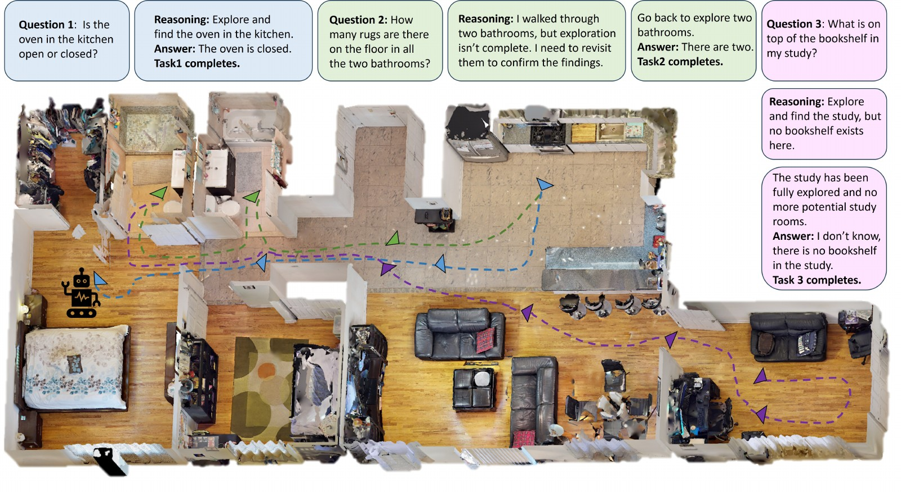

<div align="center">

# Vision to Geometry: 3D Spatial Memory for Sequential Embodied MLLM Reasoning and Exploration

**NeurIPS 2026**

Zhongyi Cai<sup>1</sup>\*, Yi Du<sup>2</sup>\*, Chen Wang<sup>2</sup>, Yu Kong<sup>1</sup>

<sup>1</sup>ACTION Lab, Michigan State University &nbsp;&nbsp; <sup>2</sup>SAIR Lab, University at Buffalo

[](https://arxiv.org/abs/2512.02458)
[](https://arxiv.org/pdf/2512.02458)


</div>

<p align="center">
  
</p>

<p align="center"><em>Three sequential questions in one apartment. After answering in the kitchen, the agent reuses its
spatial memory to revisit two bathrooms it had passed but under-explored; for the third question it explores the study,
finds no bookshelf, and reports the task as infeasible instead of guessing.</em></p>

---

**TL;DR** — 3DSPMR is a 3D **SP**atial **M**emory **R**easoning framework that uses Field-of-View (FoV)
coverage as an explicit geometric prior, so that an embodied agent can reuse the spatial knowledge it
accumulated in earlier tasks and can tell when a task is simply *infeasible*. We also release
**SEER-Bench**, a Sequential Embodied Exploration and Reasoning Benchmark covering EQA and
multi-modal navigation, with both feasible and infeasible objectives.

## News

- **2026-09** — Accepted to **NeurIPS 2026**. 🎉🎉🎉
- **2026-09** — Code release in preparation; this repository is being organized and will be updated shortly.
- **2026-09** — The **full SEER-Bench EQA annotations** (60 scenes) are released under [`data/SEER_EQA/`](data/SEER_EQA/).
- **2026-05** — A subset of the SEER-Bench EMN annotations is available under [`data/`](data/).

## Abstract

Embodied agents are expected to assist humans by actively exploring unknown environments and reasoning
about spatial contexts. When deployed in real life, agents often face **sequential tasks** where each new
task follows the completion of the previous one and may include **infeasible objectives**, such as searching
for non-existent objects. However, most existing research focuses on isolated goals, overlooking the core
challenge of sequential tasks: the ability to reuse spatial knowledge accumulated from previous explorations
to guide subsequent reasoning and exploration. In this work, we investigate this underexplored yet
practically significant embodied AI challenge. Specifically, we propose **3DSPMR**, a 3D SPatial Memory
Reasoning framework that utilizes Field-of-View (FoV) coverage as an explicit geometric prior. By integrating
FoV-based constraints, 3DSPMR significantly enhances an agent's memory, reasoning, and exploration
capabilities across sequential tasks. To facilitate research in this area, we further introduce **SEER-Bench**,
a novel Sequential Embodied Exploration and Reasoning Benchmark that spans two foundational tasks:
Embodied Question Answering (EQA) and Embodied Multi-modal Navigation (EMN). SEER-Bench uniquely
incorporates both feasible and infeasible tasks to provide a rigorous and comprehensive evaluation of agent
performance. Extensive experiments verify that 3DSPMR achieves substantial performance gains on both
sequential EQA and EMN tasks.

## Method

3DSPMR consists of three components:

| Component | What it does |
|---|---|
| **Unified Spatial Memory** | Selectively stores raw observations into one structured representation that combines global relational cues (3D scene graph), local visual cues (keyframes), and geometric cues (cumulative FoV coverage map), so the memory stays sparse but reusable across tasks. |
| **Geo-Reasoning** | Runs MLLM inference over the memory, then validates the prediction *post hoc* against FoV coverage: an answer is accepted only if the task-relevant rooms are covered beyond a threshold; otherwise exploration is triggered. This model-agnostic geometric check replaces model-based confidence heuristics, which are poorly calibrated. |
| **Geo-Sem Exploration** | Scores frontier candidates by combining task-driven visual semantics with a geometric incentive — the amount of unknown area falling inside the FoV projected ahead of each frontier — so the agent breaks semantic ties toward genuinely informative regions. |


## Repository status

Code is being cleaned up for release. Planned contents:

```
3DSPMR/
├── data/                 # SEER-Bench annotations
│   ├── SEER_EQA/         # full EQA track, one file per HM3DSem scene
│   └── SEER_EMN/v1/      # EMN subset, one file per HM3DSem scene
├── fig/                  # figures used in this README
├── 3dspmr/               # TODO: unified spatial memory, Geo-Reasoning, Geo-Sem exploration
├── configs/              # TODO: scene lists, backbone / hyper-parameter configs
├── scripts/              # TODO: run EQA / EMN episodes, evaluation
└── docs/                 # TODO: setup notes
```

| Item | Status |
|---|---|
| SEER-Bench EQA annotations (full, 60 scenes) | ✅ [`data/SEER_EQA/`](data/SEER_EQA/) |
| SEER-Bench EMN annotations (full, 60 scenes) | 🚧 to be released |
| 3DSPMR implementation | 🚧 to be released |


## Data

### EQA — `data/SEER_EQA/<scene>.json`

The full SEER-Bench EQA annotations: **60 HM3DSem scenes, 110 episodes, 5 questions each (550 questions)**,
of which 220 are unanswerable (40.0%). Most scenes carry two episodes with different start poses and different
question chains. Each file holds the episodes of one scene, as a list; each entry is one episode:

```jsonc
{
  "question_id":     "00009-vLpv2VX547B_1",  // episode id
  "episode_history": "00009-vLpv2VX547B",    // HM3DSem scene
  "position":        [-1.66593, 0.0101, -1.71676],   // agent start position (Habitat world frame)
  "rotation":        [0.0, 0.60448, 0.0, 0.79662],   // agent start rotation (quaternion)
  "QA_list": [
    {
      "question":      "How many brooms are there in the apartment?",
      "answer":        "2",
      "question_type": "Global Counting",    // "Unanswerable" marks an infeasible task
      "subtype":       "Global Counting",
      "frame_index":   46                    // optional: index of the annotation reference frame
    }
    // ... 5 questions, asked in order as one sequential chain
  ]
}
```

### EMN — `data/SEER_EMN/v1/<scene>.json`

A released subset of the SEER-Bench EMN annotations, in GOAT-Bench episode format: **12 HM3DSem scenes &times;
10 episodes = 120 episodes, 897 navigation tasks** (5–10 per episode), of which 358 are infeasible (39.9%).
Each file holds the episodes of one scene plus the goal-viewpoint table they index into:

```jsonc
{
  "episodes": [
    {
      "episode_id":     0,
      "scene_id":       "hm3d/val//00877-4ok3usBNeis/4ok3usBNeis.basis.glb",
      "start_position": [2.6314, -0.53553, 3.47946],
      "start_rotation": [0, 0.03233, 0, -0.99948],
      "tasks": [
        // [category, modality, object_id, feasible]                  -- feasible task
        ["boiler", "description", "boiler_117", true],
        // [category, modality, object_id, feasible, infeasible_type] -- infeasible task
        ["unicorn_statue", "object", null, false, "non_existent_object"]
        // ... tasks are attempted in order, as one sequential chain
      ]
    }
  ],
  "goals": {
    // "<scene>.basis.glb_<category>" -> instances, each with its position and
    // the viewpoints (agent pose + IoU) that count as reaching the goal
    "4ok3usBNeis.basis.glb_freezer": [
      {
        "object_category": "freezer",
        "object_id":       "freezer_2",
        "position":        [1.13531, -0.21143, 5.9484],
        "view_points":     [{"agent_state": {"position": [...], "rotation": [...]}, "iou": 0.66337}]
      }
    ]
  }
}
```

Goal modalities are `object` / `description` / `image` (345 / 268 / 284 tasks). Infeasible tasks carry the reason
they are impossible: `non_existent_object` (133), `modified_description` (112) and `different_scene_image` (113) —
the object is absent, the description does not match any instance, or the goal image comes from another scene.

Scene meshes are not redistributed here — HM3DSem must be obtained from its
[official release](https://aihabitat.org/datasets/hm3d-semantics/).

## Getting started

🚧 Installation, data preparation and run instructions will be added together with the code release.

## Citation

```bibtex
@inproceedings{cai2026vision,
  title     = {Vision to Geometry: 3D Spatial Memory for Sequential Embodied MLLM Reasoning and Exploration},
  author    = {Cai, Zhongyi and Du, Yi and Wang, Chen and Kong, Yu},
  booktitle = {Advances in Neural Information Processing Systems (NeurIPS)},
  year      = {2026}
}
```

## Acknowledgements

SEER-Bench is built on [HM3DSem](https://aihabitat.org/datasets/hm3d-semantics/) and the
[Habitat](https://aihabitat.org/) simulator. We compare against [3D-Mem](https://github.com/UMass-Embodied-AGI/3D-Mem)
and the [GOAT-Bench](https://github.com/Ram81/goat-bench) baselines, and thank their authors for releasing
their code.

## License

🚧 To be added with the code release.
